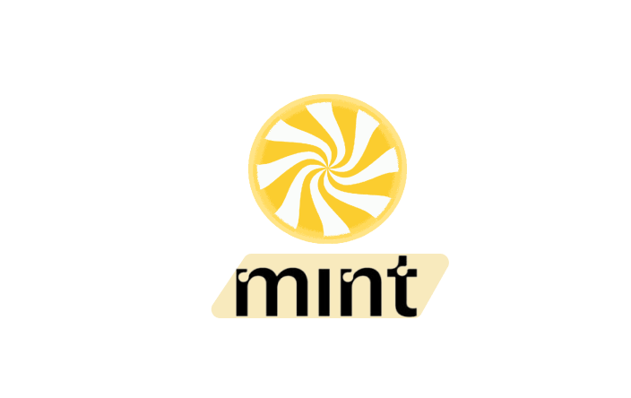

<!--
*** Thanks for checking out the Best-README-Template. If you have a suggestion
*** that would make this better, please fork the repo and create a pull request
*** or simply open an issue with the tag "enhancement".
*** Don't forget to give the project a star!
*** Thanks again! Now go create something AMAZING! :D
-->

<!-- PROJECT SHIELDS -->
<!--
*** I'm using markdown "reference style" links for readability.
*** Reference links are enclosed in brackets [ ] instead of parentheses ( ).
*** See the bottom of this document for the declaration of the reference variables
*** for contributors-url, forks-url, etc. This is an optional, concise syntax you may use.
*** https://www.markdownguide.org/basic-syntax/#reference-style-links
-->
<!-- [![Contributors][contributors-shield]][contributors-url]
[![Forks][forks-shield]][forks-url]
[![Stargazers][stars-shield]][stars-url]
[![Issues][issues-shield]][issues-url]
[![MIT License][license-shield]][license-url]
[![LinkedIn][linkedin-shield]][linkedin-url] -->

<!-- PROJECT LOGO -->
 

  
  <h1 align="center">Mint - NFT Marketplace!</h1>
  
  
  

 

## 🧐 Objective 
People who want to make a living as a comic/digital artist don't have a place to show off their work or earn money. Mint allows you to take a stand for yourself. This programme also aims to reintroduce comics to the mainstream by digitising them and merging them into the metaverse's future vision.

 
 

<!-- ABOUT THE PROJECT -->
## ⚒️ About The Project

Mint is a blockchain-based comic app that allows content creators to create new comics based on their imaginations and sell them on the market for cryptocurrency. People who wish to make comics as a living can receive a platform to display their ability while also earning money for their efforts.

 
 

## 🙌🏻 Novelty of our project
- Mint allows users to employ neural style transfer to turn their photographs to comic style.
- Because the app was created with Flutter, it is compatible with both Android and iOS.
- The Ethereum Block-chain facilitates all transactions.
This application fits into the metaverse's long-term vision.

 
 

## 👩🏻‍💻Tech Stack

* [Solidity](https://docs.soliditylang.org/en/v0.8.11/) 
* [Hardhat](https://hardhat.org/) 
* [Flutter](https://flutter.dev/)
* [Deep AI : Neural Style Transfer API](https://deepai.org/machine-learning-model/fast-style-transfer)

 
 

## ✨ Future Scope
- Can be used as a trading platform 
- Can assist creators in bidding on their comics 
- Can provide an option for industries to hire creators 
- Allowing users to pay with any cryptocurrency rather than only Ethereum 
- Can provide a bidding mechanism for exclusive NFTs

 
 

## 👫 Contributors 

* [Swarup Kharul](https://github.com/SwarupKharul)
* [Suryakant Aggarwal](https://github.com/suryaa62)
* [Vineet Raj](https://github.com/vinmik)
* [Vanshika Nehra](https://github.com/VanshikaNehra23)

